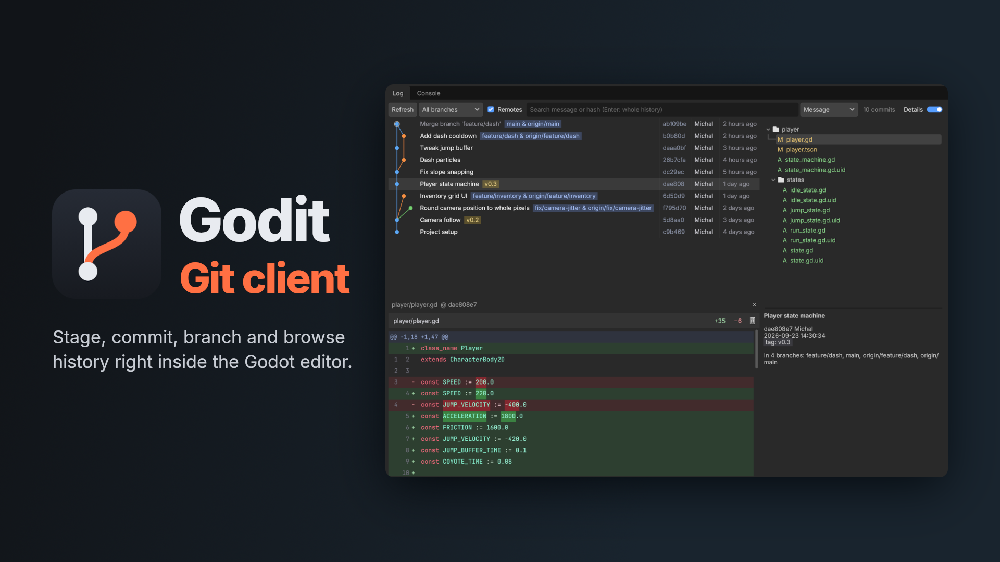

# Godit

A git client inside the Godot editor. See what changed, stage and commit, switch branches and browse the history as a commit graph, without leaving the editor.

## Features

- **Changes panel**: changed files as a folder tree. Tick a checkbox to stage a file, a folder or a whole group.
- **Partial staging**: stage, unstage or revert a single hunk or selected lines.
- **Diff view**: unified or side-by-side, with word-level highlights, script editor syntax colors and before/after image previews.
- **Changelists and shelving**: group changes and commit or stash them separately.
- **Commit, Amend, Commit and Push.**
- **Branches**: checkout, create, rename, delete, merge and rebase, with ahead/behind counts. Remotes, tags and stashes are in the same panel.
- **Fetch, pull and push** run in the background with progress and Cancel. Common failures come with an explanation and a suggested fix.
- **Conflict resolver**: side-by-side Ours / Theirs / Base. Continue, Skip or Abort merges, rebases and cherry-picks.
- **Git Log**: commit graph with branch and tag badges. Search by message or code, see commit details and per-file diffs.
- **History editing**: cherry-pick, revert, reset, reword, fixup, squash, drop and undo the last commit.
- **Script editor**: changed lines in the gutter, inline preview with Rollback, optional blame column and a Git right-click submenu.
- **Git Console**: every command the plugin runs, plus a prompt for your own.

Godit uses your system `git`, so there is nothing native to build. It works on Windows, macOS and Linux.

## Requirements

- Godot 4.4 or newer
- `git` installed and on `PATH` (check with `git --version` in a terminal)
- The Godot project inside a git repository (the repo root can be above the project folder)

## Install

1. Copy `addons/godit/` into your project's `addons/` folder, or install Godit from the Asset Library.
2. Enable **Godit** in Project Settings > Plugins.

After that you will see:

- a **Git** dock on the left with the Changes and Branches tabs
- a **Git Log** tab in the bottom panel
- change markers in the script editor gutter

## Remote access (push, pull, fetch)

Godit never shows password prompts, because the editor has no terminal to type into. Git has to authenticate on its own:

- **HTTPS**: set up a credential helper (Git Credential Manager on Windows and macOS, `git config --global credential.helper store` on Linux, or a GitHub CLI login with `gh auth login`).
- **SSH**: load your key into `ssh-agent` and connect to the host once from a terminal so its key is accepted.

If `git push` works in a terminal without asking for anything, it works in Godit too.

## Usage

- **Commit**: tick the files in Changes, type a message and press `Ctrl+Enter` (`Cmd+Enter` on macOS). `Ctrl+Shift+Enter` commits and pushes.
- **Stage part of a file**: open the file's diff, then stage a hunk or select lines and stage those.
- **Right-click** a file, branch or commit for everything else: revert, ignore, show history, cherry-pick, reset and more.
- **In the script editor**, click a gutter marker to preview the change and roll it back.
- **Switch branches** in the Branches tab. The sync bar at the top shows what's waiting to be pulled or pushed.

## Settings

Project > Tools > Godit:

| Option | Default | What it does |
| --- | --- | --- |
| Auto-reload files changed externally | on | Reload scripts changed by git (checkout, pull, revert) without asking |
| Auto-save scripts every 3s | off | Keeps the Changes panel in sync with what you type |
| Dock Changes/Branches at bottom | off | Moves the Git dock into the bottom panel |
| Fetch remotes in the background every 10 min | off | Keeps ahead/behind counts current |
| Show blame in the script editor | off | Author and age column next to each line |

The auto-reload and auto-save options change the matching Godot editor settings. Settings are per user and stored outside the project, in `user://godit_settings.cfg`.

## License

MIT, see [LICENSE](LICENSE).
